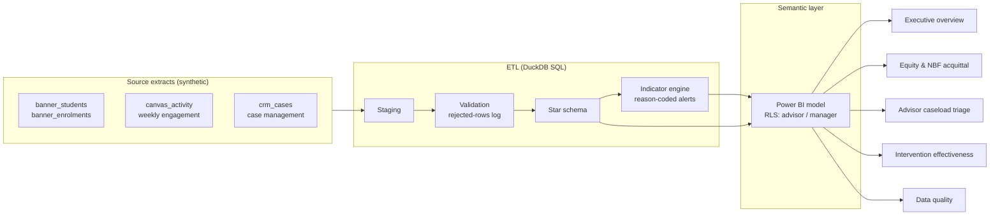
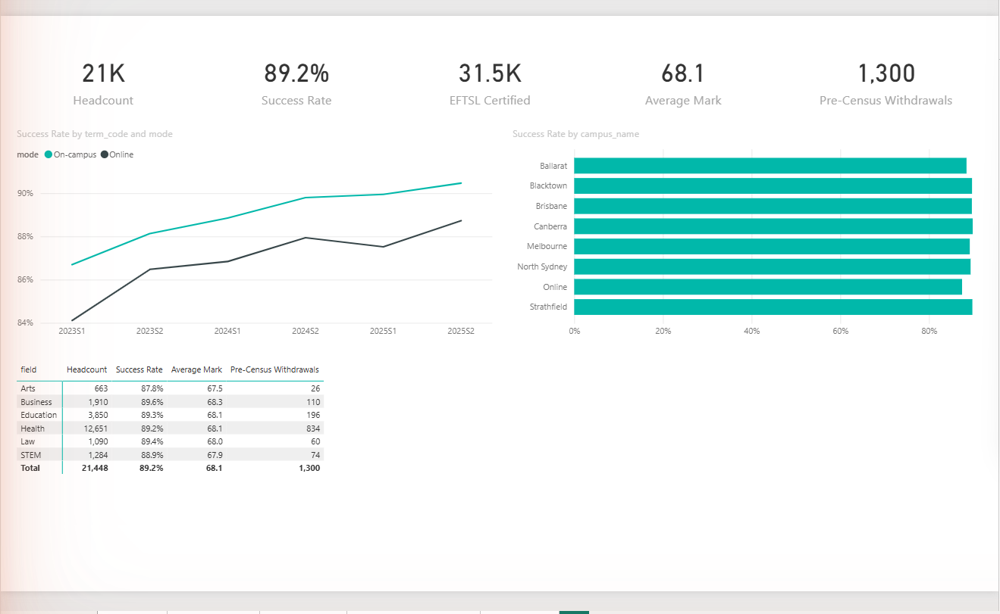
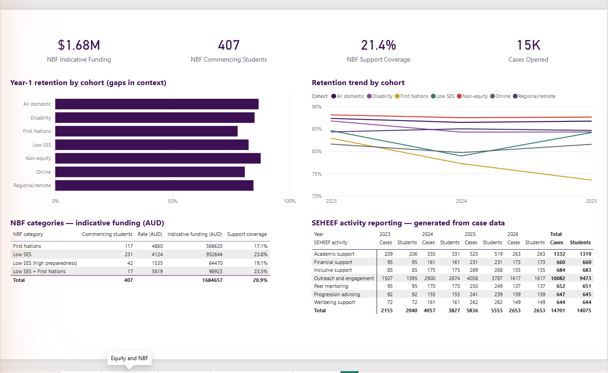
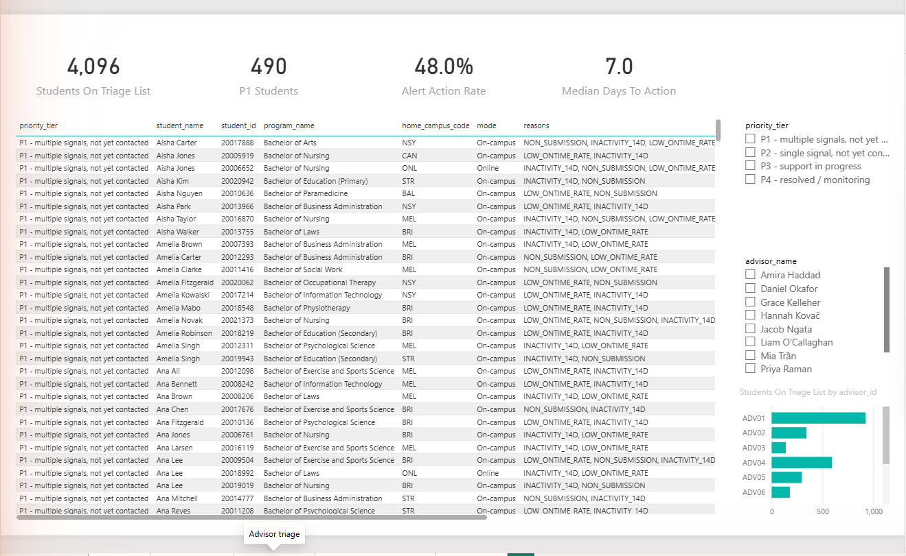
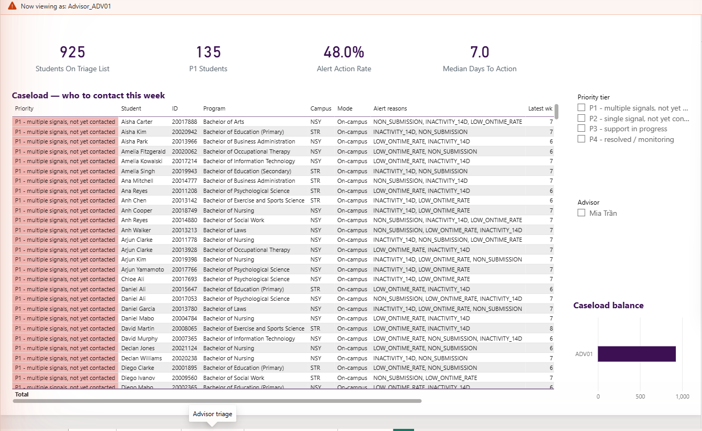
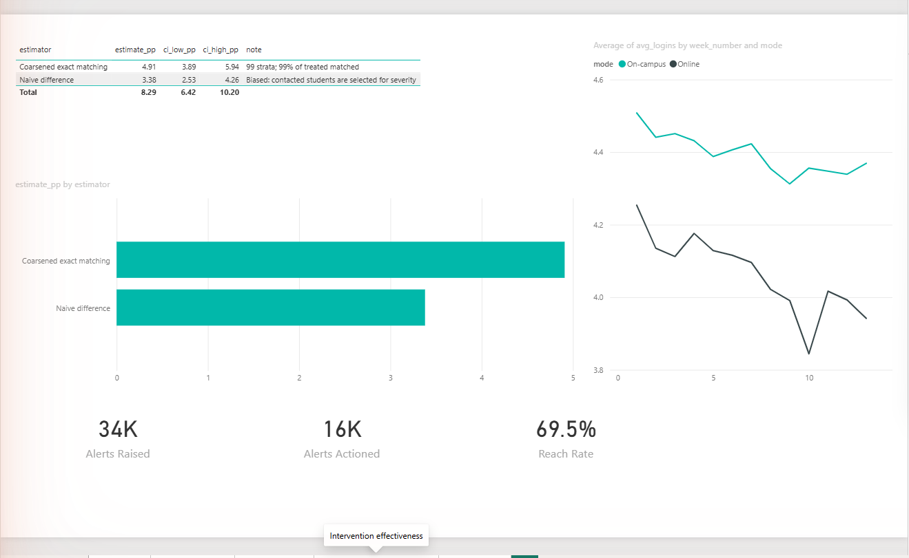
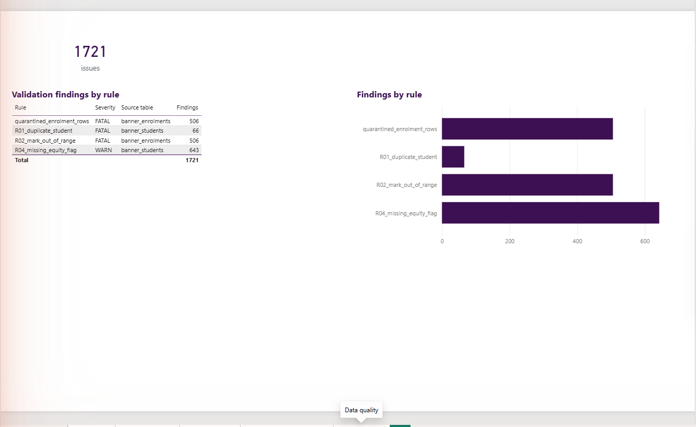

# Compass — a Student Success Data Environment (working prototype)

**Early-alert analytics and Needs-based Funding accountability for an Australian multi-campus university.**

Compass is a working prototype of the data environment described in the ACU *Data Analyst, Student Care and Success* position description: an end-to-end pipeline that integrates student information system, learning management system, and case-management data into a governed dimensional model powering advisor-facing early-alert triage, executive retention reporting, and Needs-based Funding (NBF) acquittal evidence.

**▶ [Watch the 3½-minute walkthrough](https://github.com/syarifahhaninah/compass-student-success/releases/download/v1.0/compass-walkthrough-captioned.mp4)** — all five dashboard pages, including the live row-level-security switch.

> **All data in this repository is synthetic.** It is generated to be statistically consistent with published Australian sector benchmarks (Department of Education Section 15 attrition/retention tables; ACSES retention analyses), but no real student, staff, or institutional record is used anywhere. Real student data is far too sensitive for a portfolio project — treating it that way is part of the point.

## Why this exists

Three regulatory forces converged on Australian student-success teams between 2024 and 2027:

1. **Support for Students Policy** (Higher Education Provider Guidelines Ch 10A): providers must maintain documented processes for identifying students at risk and evidence that identified students received support. TEQSA audits the follow-through, not just the flagging.
2. **Needs-based Funding** (from 1 Jan 2026): per-student equity funding with activity-level acquittal reporting due early 2027, aligned to the SEHEEF program logic.
3. **Universities Accord / ATEC** participation and completion targets for equity cohorts.

Compass demonstrates the data infrastructure those three obligations share: one governed model where every alert has a lifecycle, every intervention is tagged to a SEHEEF program-logic node at the point of entry, and every metric uses the official Department of Education definition — so compliance reporting is a by-product of daily operations rather than a year-end reconstruction.

## Architecture



**Prototype stack:** Python (generator) → DuckDB (SQL ETL) → CSV warehouse layer → Power BI Desktop.
**Production translation** (documented in [`sql/`](sql/)): Azure SQL / Synapse + Azure Data Factory + Power BI service — matching a Banner + Canvas + CRM + Azure/Power BI institutional environment.

## Design provenance

Every material design decision is borrowed from a documented case or avoids a documented failure — see [docs/design-provenance.md](docs/design-provenance.md). Highlights:

| Decision | Because of |
|---|---|
| Reason-coded, transparent alert indicators (no opaque scores) | The Markup's 2021 EAB Navigate investigation (race used as predictor; advisors untrained on scores) |
| Engagement-first indicators; demographics for context, never as risk predictors | Nottingham Trent StREAM's bias-avoiding design; Australian explainable-LA research |
| Closed-loop alert lifecycle (raised → triaged → contacted → outcome → re-assessed) | The sector's #1 failure mode (flag-without-follow-up) and TEQSA's compliance focus |
| Matched-comparison intervention evaluation, never raw before/after | The Purdue Course Signals causal-inference collapse; Civitas PPSM standard |
| SEHEEF program-logic tagging on every case record | NBF acquittal reporting due early 2027 — reporting as a by-product of operations |
| Official DoE metric definitions + TCSI-style element references | "One metric, one definition" alignment with institutional data governance |

## Repository layout

```
generator/   Synthetic source-system data generator (Python, seeded, configurable)
etl/         DuckDB SQL ETL: staging → validation → star schema → indicator engine
sql/         Production-grade T-SQL DDL translation of the warehouse
data/raw/        Generated source extracts (gitignored; regenerate with one command)
data/warehouse/  Dimensional layer consumed by Power BI (gitignored)
data/quality/    Validation rejects and defect logs (gitignored)
powerbi/     Semantic model spec, DAX measures, theme, page build guide
docs/        Traceability matrix, data dictionary, ERD, ethics note, limitations
```

## Quick start

```powershell
python -m venv .venv
.venv\Scripts\Activate.ps1
pip install -r requirements.txt
python generator/generate.py          # writes data/raw/
python etl/run_etl.py                 # writes data/warehouse/ + data/quality/
python etl/validate_output.py         # sanity-check rates against sector benchmarks
python etl/effectiveness.py           # naive vs matched intervention evaluation
python etl/fairness_audit.py          # alert/outreach equity audit (the ethics note, tested)
python powerbi/build_pbip.py          # emit the Power BI project (semantic model as code)
```

Then open `powerbi/pbip/compass.pbip` in Power BI Desktop (tables,
relationships, measures and RLS roles arrive pre-built; visuals are assembled
per [powerbi/page-guide.md](powerbi/page-guide.md)). If Desktop rejects the
generated project, fall back to the manual load in
[powerbi/model-spec.md](powerbi/model-spec.md).

## The dashboards

Built as code (`powerbi/build_report.py` emits every visual with its semantic
query) and rendered in Power BI Desktop against the loaded model.
**[Video walkthrough (3:25, captioned)](https://github.com/syarifahhaninah/compass-student-success/releases/download/v1.0/compass-walkthrough-captioned.mp4)** — produced from code too: see [powerbi/video/](powerbi/video/).

| Page | The question it answers |
|---|---|
|  | **Executive** — how are our students going? 89.2% success rate, on-campus vs online gap, program matrix |
|  | **Equity & NBF** — $1.68M indicative 2026 funding by cohort; retention gaps in context; SEHEEF acquittal matrix generated from case data |
|  | **Advisor triage** — 4,096 students tiered P1–P4 with plain-language reasons and tier colour-coding |
|  | **Row-level security, live** — the same page viewed as Advisor_ADV01: 925 students (her campuses only), P1s down to 135, advisor slicer reduced to her name. Managers see all; advisors see their caseload |
|  | **Intervention effectiveness** — matched +4.9pp vs naive +3.4pp; method validated against injected ground truth |
|  | **Data quality** — every validation finding, quarantine counts, 100% catch rate vs the injected answer key |

## Honest limitations

- Synthetic behaviour is simpler than reality: engagement is simulated weekly (real Canvas Data 2 is event-level), and the intervention effect is *injected* at a known magnitude — deliberately, so the evaluation method can be validated against ground truth.
- Source schemas are *shaped like* Banner / Canvas / CRM extracts, not replicas.
- SA1-level SES derivation is simulated via postcode quartiles; a production build would use the ABS IEO lookup on first recorded address per the NBF guidance.
- In a real deployment, indicator thresholds and outreach protocols would be co-designed with advisors and — for First Nations cohorts — with the appropriate Indigenous education unit, following UNE/Oorala precedent. A prototype cannot substitute for that consultation.

## Ethics

See [docs/ethics-note.md](docs/ethics-note.md): support-first framing, student agency, fairness auditing across equity cohorts, and data minimisation — written against the Jisc Code of Practice and the ethics-of-care literature (Prinsloo & Slade).

---

*Author: Syarifah Haninah · Built July 2026 · All data synthetic*
