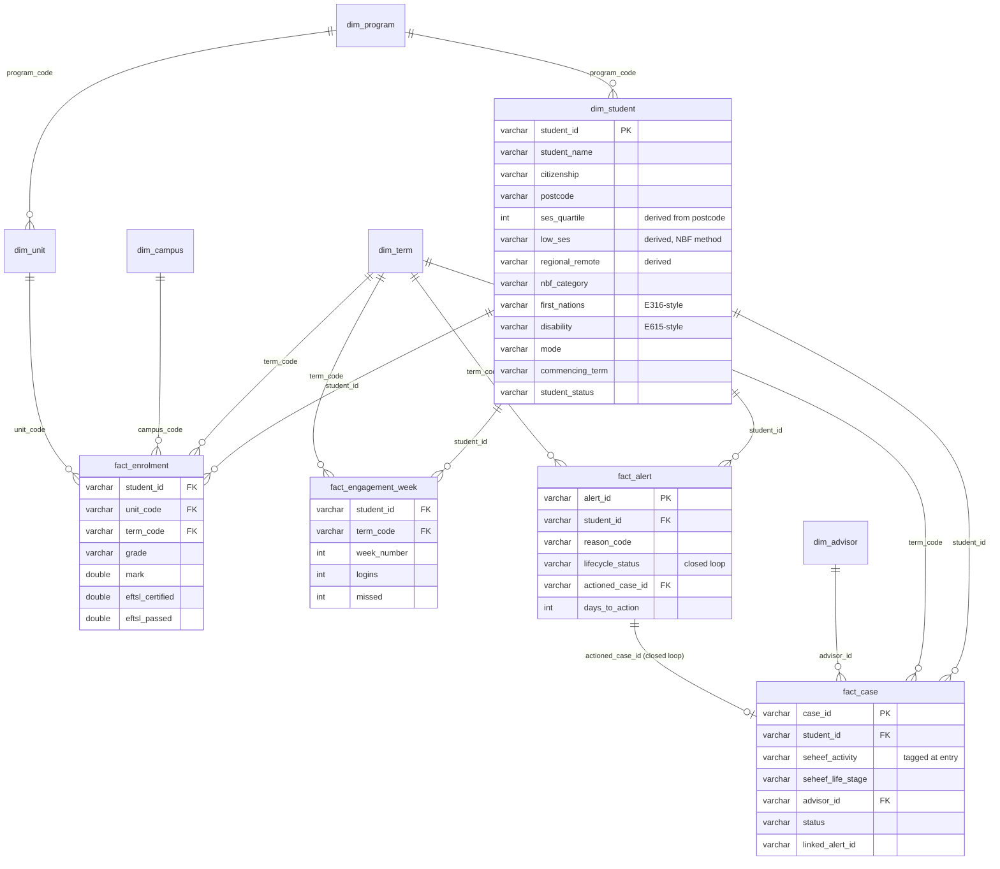

# Compass Warehouse ERD

**Flow:** raw extracts (Banner/Canvas/CRM-shaped) → staging (format repair,
synonym mapping, survivorship dedupe) → validation (dq_issues + quarantine) →
dimensions (NBF derivations) → facts (closed-loop alert lifecycle) → marts
(one per dashboard decision).
